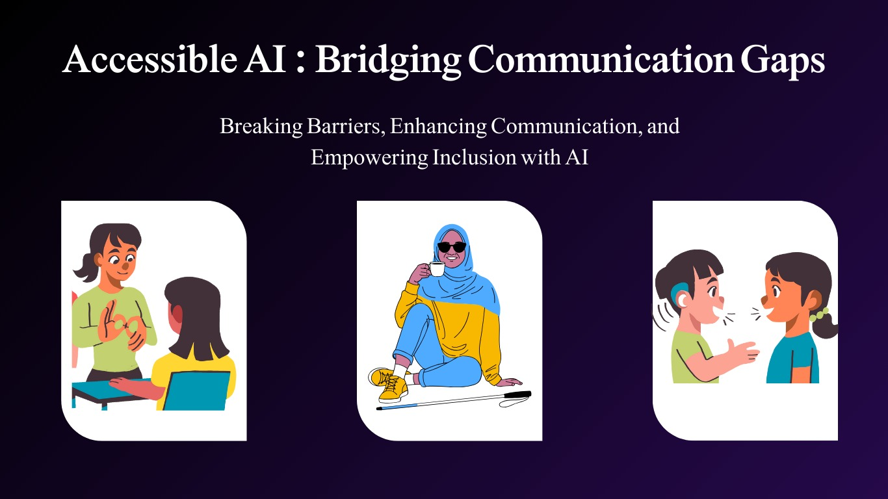

# Accessible AI — Communication Modality Prototypes



## About the project

Accessible AI is a small collection of Streamlit prototypes exploring different
communication modalities for accessibility: speech-to-text, text-to-speech, a sign
vocabulary lookup, and gesture-based shortcuts. It started as a proof of concept and
is being actively rebuilt into a more cohesive, honestly-scoped project. This README
describes what the app **actually does today** — see [Roadmap](#roadmap) for where
it's headed.

## What's in here today

| Page | What it does | Known limitation |
|---|---|---|
| **Speech to Text** | Transcribes speech using Google's speech-recognition API via `SpeechRecognition` | Opens the microphone of the machine *running the Streamlit process*, not the browser user's mic — works locally, not reliably on a hosted deployment |
| **Text to Speech** | Converts typed text to audio with `gTTS` | Requires an internet connection (gTTS calls Google's TTS service) |
| **Sign Vocabulary Explorer** | Looks up a small, fixed set of stored sign images for known words/phrases | This is a vocabulary lookup, not sign-language translation — ASL has its own grammar that word-by-word image lookup doesn't capture |
| **Gesture Shortcuts** | Recognizes 7 generic hand gestures (thumbs up, peace sign, etc.) via MediaPipe's built-in gesture recognizer and maps each to a shortcut phrase | This is generic gesture recognition with manually assigned labels, not sign-language recognition; camera access has the same local-machine limitation as the mic above |

## Why the naming changed

Earlier versions of this README described "Text-to-Sign Language" translation and
"Sign Language Recognition." Neither claim was accurate for what the code does — both
features work on a small fixed vocabulary/gesture set rather than actual sign-language
grammar. The pages and README now describe what's really happening.

## Tech stack

- **UI**: Streamlit (multipage app)
- **Speech-to-text**: `SpeechRecognition` (Google Web Speech API)
- **Text-to-speech**: `gTTS`
- **Gesture recognition**: MediaPipe Gesture Recognizer, OpenCV

## Installation

### Prerequisites

Python 3.10+ is recommended.

### Steps

```bash
git clone https://github.com/koshtiakanksha/Accessible_AI.git
cd Accessible_AI
python -m venv venv
source venv/bin/activate  # On Windows: venv\Scripts\activate
pip install -r requirements.txt
streamlit run Home.py
```

Because the speech and gesture pages access the microphone/camera of the machine
running the process, run this locally to try those two features — a cloud-hosted
deployment (e.g. Streamlit Community Cloud) will not have access to your device's
mic/camera through this architecture.

## Known limitations (read before assuming a feature works)

- Speech-to-text and gesture recognition both access the *server's* microphone/camera,
  not the browser user's — this only works meaningfully when run locally.
- The sign vocabulary and gesture-shortcut sets are both small and fixed; neither is a
  general-purpose sign-language system.
- There is no automated test suite or accuracy evaluation yet (in progress — see
  Roadmap).
- gTTS requires an internet connection; there's no offline fallback.

## Roadmap

This project is being rebuilt in phases toward a more complete, honestly-scoped
"one product" experience rather than four separate demos:

1. **Integrity pass** *(current)* — fix known bugs, rename misleading features, document
   real limitations.
2. Move speech/camera capture to the browser (e.g. `streamlit-webrtc`) so the hosted
   demo actually works for visitors, not just local runs.
3. Merge the modalities into a single conversation view (live captions + type-to-speak
   reply + gesture shortcuts together).
4. Formal evaluation of the gesture recognizer (precision/recall/F1 per class, false-
   activation rate) and a spot-check of transcription accuracy.
5. Basic automated tests + CI.

## Contributing

Contributions are welcome — fork, branch, commit, open a PR.

## License

MIT License.
